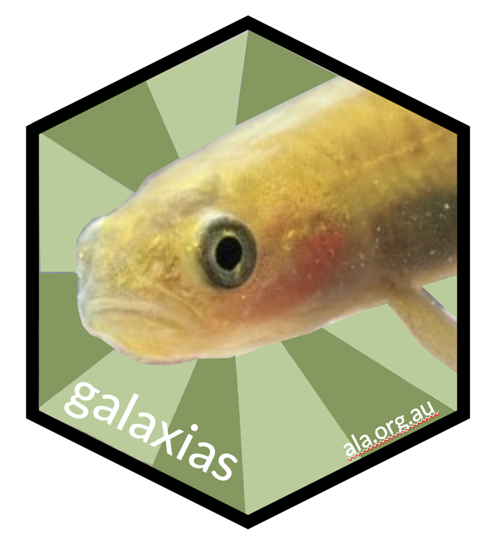

:notoc:

|galaxias-logo|   galaxias
=====================================

**Date**: |today|  **Version**: |version|  

The ``galaxias`` package offers a streamlined workflow for users to prepare 
their biodiversity data for submission to the living atlases. This package 
helps users to reformat their data according to Darwin Core standards 
prior to submission, while still maintaining control over their data.

``galaxias-python`` was built and is maintained by the 
`Science & Decision Support Team <https://labs.ala.org.au/>`_ 
at the `Atlas of Living Australia (ALA) <https://www.ala.org.au/>`_.  
``galaxias-python`` is a collective name for cockatoos (udner the subgenus 
*Licmetis*), a widely-distributed endemic Australian species.  
The logo was designed by `Ian Brennan <http://www.iangbrennan.org/>`_.

If you have any comments, questions or suggestions, please `contact us <mailto:support@ala.org.au>`_.

.. toctree::
   :maxdepth: 2
   :hidden: 

   Getting Started <getting_started/index>
   Galaxias User Guide <galaxias_user_guide/index>
   API Docs <apidoc/galaxias>
   Authors <authors/index>

.. grid:: 1 2 2 2
    :gutter: 4

    .. grid-item-card::
        :link: getting_started/index.html
        :class-card: sd-text-black
        :text-align: center

        .. raw:: html
            :file: _static/icons/getting_started_rocket.svg
                
        **Getting started**

        New to ``galaxias``?

    .. grid-item-card::
        :link: galaxias_user_guide/index.html
        :class-card: sd-text-black
        :text-align: center

        .. raw:: html
            :file: _static/icons/configuration.svg

        **Galaxias User Guide**

        Want to know more about how to use ``galaxias``?

    .. grid-item-card::
        :link: apidocs/galaxias.html
        :class-card: sd-text-black
        :text-align: center

        .. raw:: html
            :file: _static/icons/user_guide.svg

        **API Docs**

        Want to browse ``galaxias``' API docs?
    
    .. grid-item-card:: 
        :class-card: sd-text-black
        :link: authors/index.html
        :text-align: center

        .. raw:: html
            :file: _static/icons/faq.svg

        **Authors**

        Who wrote ``galaxias``? Want to cite the package?