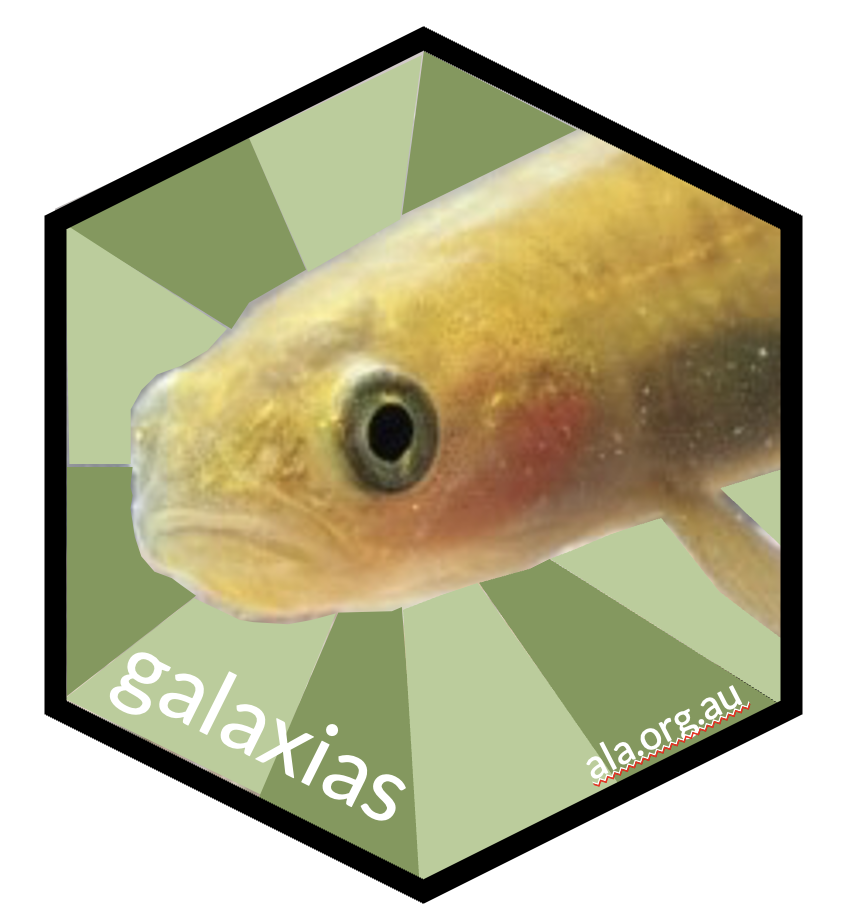

:notoc:

|galaxias-logo|   galaxias
=====================================

**Date**: |today|  **Version**: |version|  

``galaxias`` is a Python package that helps users describe, bundle, and share biodiversity 
information using the `‘Darwin Core’ <https://dwc.tdwg.org/>`_ data standard. ``galaxias`` 
provides tools in Python to build a Darwin Core Archive, a zip file containing standardised 
data and metadata accepted by global data infrastructures. The package mirrors functionality 
in `zipfile <https://docs.python.org/3/library/zipfile.html>`_, `shutils <https://pypi.org/project/shutils/>`_, 
and `os <https://docs.python.org/3/library/os.html>`_ to manage data, files, and folders. 
``galaxias`` was created by the `Science & Decision Support Team <https://labs.ala.org.au/>`_ 
at the `Atlas of Living Australia (ALA) <https://www.ala.org.au/>`_.

The package is named for a genus of freshwater fish that is found only in the Southern 
Hemisphere, and predominantly in Australia and Aotearoa New Zealand. The logo shows a 
Spotted Galaxias (Galaxias truttaceus) drawn by `Ian Brennan <https://www.iangbrennan.org/>`_.

If you have any comments, questions or suggestions, please `contact us <mailto:support@ala.org.au>`_.

.. toctree::
   :maxdepth: 2
   :hidden: 

   Getting Started <getting_started/index>
   Galaxias User Guide <galaxias_user_guide/index>
   API Docs <apidoc/galaxias>
   Authors <authors/index>

.. grid:: 1 2 2 2
    :gutter: 4

    .. grid-item-card::
        :link: getting_started/index.html
        :class-card: sd-text-black
        :text-align: center

        .. raw:: html
            :file: _static/icons/getting_started_rocket.svg
                
        **Getting started**

        New to ``galaxias``?

    .. grid-item-card::
        :link: galaxias_user_guide/index.html
        :class-card: sd-text-black
        :text-align: center

        .. raw:: html
            :file: _static/icons/configuration.svg

        **Galaxias User Guide**

        Want to know more about how to use ``galaxias``?

    .. grid-item-card::
        :link: apidocs/galaxias.html
        :class-card: sd-text-black
        :text-align: center

        .. raw:: html
            :file: _static/icons/user_guide.svg

        **API Docs**

        Want to browse ``galaxias``' API docs?
    
    .. grid-item-card:: 
        :class-card: sd-text-black
        :link: authors/index.html
        :text-align: center

        .. raw:: html
            :file: _static/icons/faq.svg

        **Authors**

        Who wrote ``galaxias``? Want to cite the package?